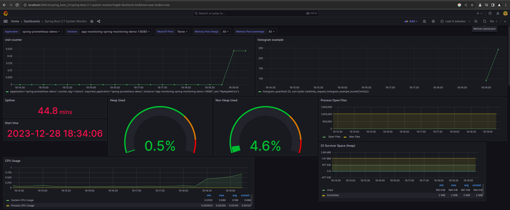

# Springboot +Prometheus +Grafana

This is a simple springboot RESTAPI that demostrates usage of alarting and monitoring



## Getting started

Build the spring project in spring-monitoring-demo

```bash
mvn clean package
```

Edit the Dockerfile in `spring-monitoring-demo` to point to the new jar file which will be in `target` folder

Change back to `app-monitoring` and run `docker-compose up` command.

## Endpoints

- Grafana dashboard will be on `localhost:3000`
- prometheus will be on `localhost:9090`
- springboot ap will be on `localhost:8080`

supported paths by springboot ap:
| endpoint |  path  |
|----------|----|
| visit-api | 8080/visit-api|
| get-responsetime | 8080/get-responsetime |
| get-queue-size | 8080/get-queue-size |
| histogram | 8080/histogram |
